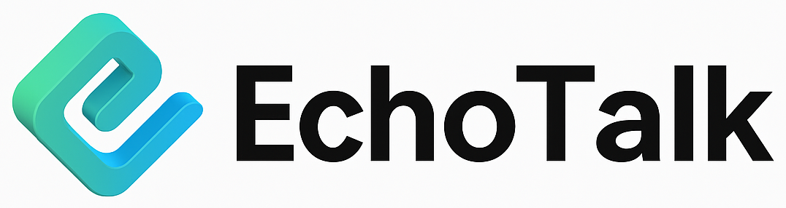

<a id="readme-top"></a>

<br />
<div align="center">
  
  <h3 align="center">Private Local Chatbot Service for Enterprises</h3>
  <h align="center">정보유출 걱정없는 기업 맞춤형 Private LLM</h>
  
</div>

## About The Project

해당 프로젝트는 기업용 사내 로컬 챗봇 서비스입니다. 비즈니스 환경에서 LLM을 사용할 수 있도록 대량의 사내 데이터를 학습하여 도메인에 맞춤화시킨 솔루션입니다.
온프레미스 구축으로 민감한 기업 정보가 외부로 유출되는 것을 방지하고, 기업의 지식 및 문서 기반 정확한 출처로 신뢰성 높은 답변을 제공하여 업무 효율을 높이도록 설계되었습니다.

### Built With

- [React](https://react.dev/)
- [TypeScript](https://www.typescriptlang.org/)
- [Vite](https://vitejs.dev/)
- [Tailwind CSS](https://tailwindcss.com/)
- [Shadcn/UI](https://ui.shadcn.com/)

## Getting Started

해당 프로젝트를 로컬에서 실행하려면 아래의 단계를 따라주세요.

### Prerequisites

- Node.js (최소 18.x 권장)
- npm

설치가 안 되어 있다면 아래 명령어로 설치하세요:

```sh
npm install npm@latest -g
```

### Installation

1. 저장소를 클론합니다.
   ```sh
   git clone https://github.com/mintuchel/echotalk-client.git
   cd echotalk-client
   ```
2. 의존성 패키지를 설치합니다.
   ```sh
   npm install
   ```
3. API 서버가 필요하다면, [백엔드 서버](https://github.com/mintuchel/echotalk-server.git)를 별도로 실행해야 합니다.

4. 클라이언트 서버를 실행합니다.
   ```sh
   npm run dev
   ```
5. 브라우저에서 [http://localhost:5173](http://localhost:5173) (Vite 기본 포트)로 접속합니다.

## Features

### 1. 로그인


### 2. 회원가입


### 3. 일반 채팅


### 4. 회사 정보 관련 채팅


### 5. 직원/부서 정보 관련 채팅


### 6. 규정 정보 관련 채팅


<p align="right">(<a href="#readme-top">back to top</a>)</p>

## 아쉬운 점

1. 이번 Chatbot 시스템을 개발하면서 VectorDB에 대해 알게 되었습니다. VectorDB에 대한 공부를 통해 성능 개선까지 시도해보고 싶었는데 프로젝트 도중 다른 업무를 배정받게 되어 거기까지 나아가지는 못했다.

2. 현재 VectorDB에 GoogleColab을 통해서 데이터를 수동으로 복붙하고 DB 스키마에 맞게 직접 변환 과정을 거쳐 데이터를 저장하였다. 이러한 수고를 덜기 위해 데이터 파이프라인까지 만들어 손쉽게 데이터를 추가하려고 했으나 못했다.
